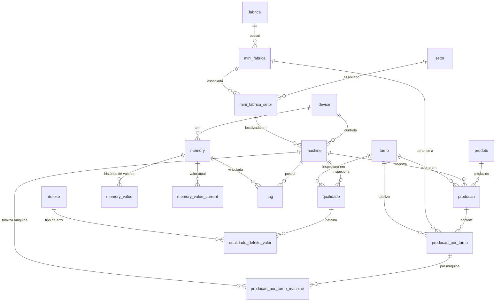

# Modelo de Entidade e Relacionamento (ERD)

Este documento descreve as tabelas e os relacionamentos do banco de dados do sistema hotsLinkOmron.

## Diagrama de Relacionamentos

## Dicionário de Relacionamentos

### Núcleo de Estrutura
- **fabrica -> mini_fabrica**: Relação 1:N. Uma fábrica física pode ser dividida em várias mini-fábricas ou células.
- **mini_fabrica_setor**: Tabela associativa que vincula setores específicos a mini-fábricas. É a base para a localização de máquinas.
- **machine**: A entidade central da linha de produção, vinculada a um dispositivo de controle (`device`) e a uma localização (`mini_fabrica_setor`).

### Núcleo de Automação
- **device -> memory**: Um dispositivo (CLP) possui endereços de memória mapeados (DM, RR, etc.).
- **tag**: Vincula uma máquina a um endereço de memória específico para monitoramento de variáveis.
- **memory_value / memory_value_current**: Armazenam os dados lidos do CLP. A tabela `current` guarda apenas o estado mais recente para acesso rápido.

### Núcleo de Produção
- **producao**: Registra a quantidade produzida por máquina, produto e turno. Inclui métricas de tempo de atividade e parada.
- **produto**: Catálogo de produtos com especificações de formato e metragem.

### Núcleo de Qualidade
- **qualidade**: Cabeçalho de inspeção por máquina e turno.
- **qualidade_defeito_valor**: Detalhamento da inspeção, associando a quantidade de itens encontrados para cada tipo de `defeito`.

### Núcleo de Consolidação (BI)
- **producao_por_turno / machine**: Tabelas de agregação diária utilizadas para geração de relatórios e dashboards de produtividade.
